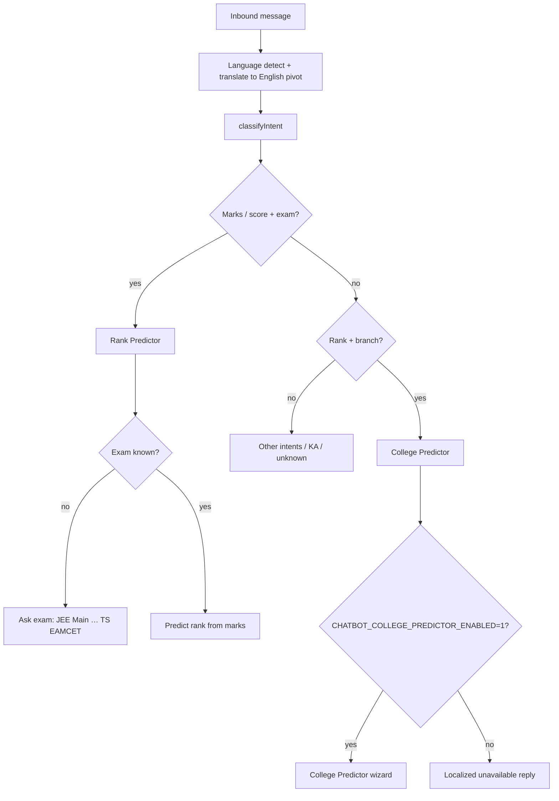

# Phase 6 Hotfix — Before / After Pipeline Traces

## Fix 1 — User rank no longer blocked by guardrail

### Before

```
Telugu: "15000 ర్యాంక్‌తో CSE వస్తుందా?"
  → detect: te
  → translate in: "Can I get CSE with rank 15000?"
  → intent: knowledge_assistant (session) OR unknown → tryLlmReply
  → RAG + LLM (English)
  → LLM: "With rank 15000, CSE may be possible..."
  → guardrail: unsupported_numeric_claim (15000 not in KB chunks)
  → outbound: "I do not have verified information to support that claim." (translated)
```

### After

```
Same inbound path
  → guardrail: user allowlist includes 15000 from original + English query
  → guardrail: modified=false
  → outbound: normal English answer → finalizeMultilingualOutbound → Telugu
```

**Validation messages (no guardrail fallback):**

- `Can I get CSE with rank 15000?`
- `15000 ర్యాంక్‌తో CSE వస్తుందా?`
- `97.8 percentile` (decimal allowlist)

---

## Fix 2 — Social greetings no longer hit Knowledge Assistant

### Before

```
"ela vunnaru"
  → translate: "How are you?"
  → classifyIntent(englishMessage)
  → /\bhow are\b/ → knowledge_assistant
  → RAG + LLM + guardrails
```

### After

```
"ela vunnaru" OR translated "how are you?"
  → isSocialGreeting → greeting (high)
  → resolveGreetingReply(te)
  → "నేను బాగున్నాను. మీకు ఎలా సహాయం చేయగలను?"
  → no KB, no LLM, no guardrails
```

**Unchanged:**

- `hello` / `hey` / `namaste` → `main_menu`
- `how are placements at niat` → `knowledge_assistant`

---

## Fix 3 — Unknown intent uses English pivot end-to-end

### Before

```
Telugu: "నాకు ఏ branch బాగుంటుంది?"
  → translate in: English query
  → classifyIntent(englishMessage) → unknown
  → tryLlmReply(inbound.text)  ← original Telugu
  → outbound: localizeKnownFallback only (no full translate back)
```

### After

```
Same inbound
  → tryLlmReply(englishMessage)
  → LLM English reply
  → finalizeMultilingualOutbound → Telugu reply
```

---

## English pivot coverage

| Path | Classifier input | LLM/RAG input | Outbound |
|------|------------------|---------------|----------|
| `knowledge_assistant` | `englishMessage` | `englishMessage` | `finalizeMultilingualOutbound` |
| `unknown` + LLM | `englishMessage` | `englishMessage` | `finalizeMultilingualOutbound` |
| `greeting` | `englishMessage` | none | static localized reply |
| `rank_predictor` / menu | mixed | original handlers | unchanged |

---

## Debug logging

Set `DEBUG_AI=true` to capture:

- `[LANG]` detect / translate timings
- `[KB]` retrieval IDs
- `[GUARDRAIL] Modified` / `Reason`

Structured logs on `inbound_processed` include `detectedLanguage`, `resolvedLanguage`, `translatedQuery`, `guardrailModified`.

---

## Fix 4 — Romanized Telugu/Hindi detection (ASCII)

### Before (`em chesthunnav`, no IIT lead)

```
detectedLanguage: en, source: offline, confidence: 0.92
resolvedLanguage: en
englishMessage: em chesthunnav (unchanged)
intent: unknown
finalResponseLanguage: en
```

### After

```
detectedLanguage: te, source: romanized, confidence: 0.88
resolvedLanguage: te
englishMessage: What are you doing? (translate-in)
intent: unknown → tryLlmReply(englishMessage) → finalizeMultilingualOutbound
finalResponseLanguage: te
```

### Greeting (`ela unnaru`)

```
detectedLanguage: te, source: romanized
intent: greeting (classifier on englishMessage or original phrase)
reply: Telugu static greeting via resolveGreetingReply(te)
```

**Detection source values:**

| Value | When |
|-------|------|
| `offline` | franc non-English, or English after romanized miss |
| `romanized` | heuristic te/hi match on ASCII Romanized text |
| `llm_fallback` | LLM detector when offline confidence is low |
| `fallback` | empty input / final default `en` |

---

## WhatsApp smoke test checklist (Romanized)

With `CHATBOT_MULTILINGUAL_ENABLED=1`, `DEBUG_AI=true`, backend restarted:

| Send | Verify in logs |
|------|----------------|
| `em chesthunnav` | `source: romanized`, `detectedLanguage: te`, translated outbound |
| `thinnava` | same |
| `Hi mama` | `te` if romanized token/phrase added; else document outcome |
| `kaise ho` | `source: romanized`, `hi`, greeting or translated reply |
| `Can I get CSE with rank 15000?` | still `en`, `source: offline` |

Structured log line `[chatbot:structured]` should show `detectedLanguage`, `resolvedLanguage`, `translatedQuery`.

---

## Regression audit — rank/branch, outbound translation, mixed language

See full matrix: [`phase-6-multilingual-test-matrix.md`](phase-6-multilingual-test-matrix.md)

### Before

| Issue | Symptom |
|-------|---------|
| Rank+branch under KB session | `Can I get CSE with rank 15000?` → `knowledge_assistant` → guardrail fallback |
| Rank predictor Telugu | `15000 rank ki cse vastunda` → English rank wizard reply |
| Mixed Romanized | `naaku cse kavali` → `detectedLanguage: en`, no translate-out |
| kn/ml/mr/bn greetings | English greeting fallback |

### After (expected)

| Message | detected | resolved | intent | outbound |
|---------|----------|----------|--------|----------|
| `Can I get CSE with rank 15000?` | `en` | `en`* | `rank_predictor` (beats KB session) | English* |
| `15000 rank ki cse vastunda` | `te` | `te` | `rank_predictor` | Telugu via `finalizeMultilingualOutbound` |
| `naaku cse kavali` | `te` | `te` | `unknown` → LLM | Telugu |
| `mujhe cse chahiye` | `hi` | `hi` | `unknown` → LLM | Hindi |

\*Unless conversation/IIT lead preference overrides.

### WhatsApp screenshot checklist (manual)

With `CHATBOT_MULTILINGUAL_ENABLED=1`, `DEBUG_AI=true`:

1. Reset session (`MENU`).
2. Send each of the 7 matrix messages (see test matrix doc).
3. Screenshot reply + log line showing `detectionSource`, `outboundLanguage`, `finalResponse`.
4. Attach screenshots here under **Regression screenshots** (pending manual capture).

**Regression screenshots:** _(attach after manual WhatsApp smoke)_

---

## Fix 4 — Telugu branch question: outbound translation + WhatsApp formatting

### Before

```
Telugu: "నాకు ఏ బ్రాంచ్ మంచిది?"
  → detect: te, resolve: te
  → translate in: "Which branch is good for me?"
  → intent: unknown → tryLlmReply(englishMessage)
  → LLM English reply with markdown table (| Branch |), ### headings, <br> tags
  → finalizeMultilingualOutbound → translateFromEnglish (5s / 1200 tokens)
  → silent pass-through on timeout/error → English + raw markdown sent to WhatsApp
```

### After

```
Same inbound
  → formatForWhatsApp (strip HTML, convert tables to • bullets, plain headings)
  → finalizeMultilingualOutbound with OUTBOUND_TRANSLATION_TIMEOUT_MS=12000, maxTokens=2000
  → translateFromEnglish → Telugu reply
  → formatForWhatsApp (second pass) → sendBotTextReply
  → inbound_processed log includes:
      shouldTranslateOutbound, knowledgeAssistantResponse,
      translateFromEnglishExecuted, outboundTranslationPassThrough, finalResponsePreview
```

### Expected log fields for `నాకు ఏ బ్రాంచ్ మంచిది?`

| Field | Expected |
|-------|----------|
| `detectedLanguage` | `te` |
| `resolvedLanguage` | `te` |
| `englishMessage` | English pivot (e.g. Which branch is good for me?) |
| `intent` | `unknown` (or `knowledge_assistant` if session active) |
| `knowledgeAssistantResponse` | English pre-translate text |
| `shouldTranslateOutbound` | `true` |
| `translateFromEnglishExecuted` | `true` |
| `outboundTranslationPassThrough` | `false` |
| `finalResponse` | Telugu, no `\|`, `###`, or `<br>` |

### Manual verification

1. Set `CHATBOT_MULTILINGUAL_ENABLED=1` on Vercel and local `.env`.
2. Restart backend with `DEBUG_AI=true`.
3. Send `నాకు ఏ బ్రాంచ్ మంచిది?` on WhatsApp.
4. Confirm Telugu bullet-format reply (screenshot) and structured log above.

---

## Fix 5 — Language state management (current message wins)

### Before

```
conversation.preferredLanguage = te (streak or IIT seed)
User: "आप कैसे हैं?" (Hindi, confidence 0.99)
  → resolveConversationLanguage: stored te WINS
  → outboundLanguage = te
  → Hindi user receives Telugu reply
resolutionReason: (none)
```

### After

```
Same inbound with preferredLanguage = te
  → detect: hi, confidence 0.99
  → resolve: hi (resolutionReason: high_confidence_detection)
  → greeting reply in Hindi
  → preferredLanguage updated via streak / immediate en reset
```

### Greeting audit (8 languages, preferredLanguage=te sticky)

| Message | detected | resolved | outbound | reason |
|---------|----------|----------|----------|--------|
| `How are you?` | en | en | en | high_confidence_detection |
| `మీరు ఎలా ఉన్నారు?` | te | te | te | high_confidence_detection |
| `आप कैसे हैं?` | hi | hi | hi | high_confidence_detection |
| `நீங்கள் எப்படி இருக்கிறீர்கள்?` | ta | ta | ta | high_confidence_detection |
| `നിങ്ങൾക്ക് സുഖമാണോ?` | ml | ml | ml | high_confidence_detection |
| `ನೀವು ಹೇಗಿದ್ದೀರಿ?` | kn | kn | kn | high_confidence_detection |
| `तुम्ही कसे आहात?` | mr | mr | mr | high_confidence_detection |
| `আপনি কেমন আছেন?` | bn | bn | bn | high_confidence_detection |

Run: `node scripts/live-phase6-greeting-audit.js`  
Artifacts: [`greeting-audit-results.json`](phase-6-validation-artifacts/greeting-audit-results.json), `greet_*-whatsapp-mock.html`

---

## Fix 6 — Predictor intent split (marks vs rank+branch)

### Problem

`Can I get CSE with rank 15000?` routed to **Rank Predictor** even though the user already supplied a rank. Marks-based queries (`TS EAMCET 85 marks`) must stay on Rank Predictor.

### Intent routing (after fix)



| Query type | Example | Route | Reply (College Predictor off) |
|------------|---------|-------|-------------------------------|
| Marks-based | `I scored 85 marks in TS EAMCET` | Rank Predictor | Ask exam or predict from marks |
| Marks-based | `TS EAMCET 85 marks` | Rank Predictor | Predict rank |
| Rank + branch | `Can I get CSE with rank 15000?` | College Predictor | Rank already known → CP unavailable (8 langs) |
| Rank + branch | `15000 ర్యాంక్‌తో CSE వస్తుందా?` | College Predictor | Telugu unavailable message |

### Rank Predictor exam list (WhatsApp)

JEE Main, JEE Advanced, KCET, KEAM, AP EAMCET, **TS EAMCET**

### Example conversations

**Marks → Rank Predictor**

```
User: I scored 85 marks in TS EAMCET
Bot:  Prediction for TS EAMCET:
      Predicted Rank: …
      Reply MENU for main menu.
```

**Rank + branch → College Predictor unavailable (English)**

```
User: Can I get CSE with rank 15000?
Bot:  You already provided your rank, so Rank Predictor is not needed.
      This query normally uses College Predictor.
      College Predictor is currently unavailable.
      Reply MENU for other options.
```

**Rank + branch → College Predictor unavailable (Telugu)**

```
User: 15000 ర్యాంక్‌తో CSE వస్తుందా?
Bot:  మీరు ఇప్పటికే మీ ర్యాంక్‌ను ఇచ్చారు … College Predictor ప్రస్తుతం అందుబాటులో లేదు.
```

Run: `node --test test/predictorIntentRouting.test.js`

